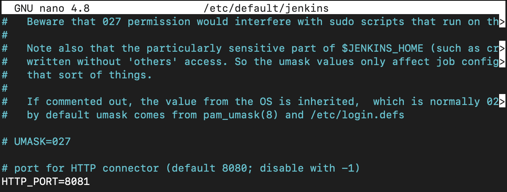
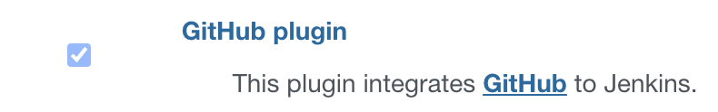

### 1. Create Jenkins VM with internet access:
For Virtual Machines I choose Digital Ocean, because of registration troubles in AWS


###  Installation of openjdk-8-jdk, Git:

```bash
sudo apt update 
sudo apt upgrade
sudo apt install openjdk-8-jdk git
```

### Installation of Jenkins and enabling autostart:

```bash
wget -q -O - https://pkg.jenkins.io/debian-stable/jenkins.io.key | sudo apt-key add - 
sudo sh -c 'echo deb https://pkg.jenkins.io/debian-stable binary/ > /etc/apt/sources.list.d/jenkins.list'
sudo apt update
sudo apt install jenkins
sudo systemctl enable jenkins
```

### Changing Jenkins port to 8081:



### Installation of plugins on Jenkins:




### Adding new user in Jenkins:


### 2. Creating Agent VM:

```bash
sudo apt update 
sudo apt upgrade
sudo apt install openjdk-8-jre git
java -version
```

### Prepare SSH keys:
#### On master:

```bash
ssh-keygen
cat ~/.ssh/id_rsa.pub
```
#### On agent:

```bash
nano ~/.ssh/authorized_keys # add here master node public key
```

### Connecting agent to master node:


#### Adding agent credentials:


### 3. Configure tools – NodeJS:


### 4. Create “Multibranch Pipeline” pipeline job (work inside Lab folder):


#### Jenkinsfile:

```groovy
pipeline {
    triggers {
        githubPush()
    } 
    
    agent {
        label 'slave'
    }

    tools {
        nodejs 'nodejs16'
    }

    stages {
        stage ('Checkout') {
            steps {
                checkout scm
            }
        }

        stage ('NPM installation') {
            steps {
                sh "npm install -g --save-dev clean-css-cli"
                sh "npm install -g uglify-js"
            }
        }

        stage ('Compressing JS/CSS') {
            parallel {

                stage ('uglify-js') {
                    steps {
                        sh "cat www/js/* | uglifyjs -o www/js/min.js"
                    }
                }

                stage ('clean-css') {
                    steps {
                        sh "cat www/css/* | cleancss -o www/css/min.css"
                    }
                }
            }
        }

        stage ('Archiving results') {
            steps {
                sh "tar -czvf results.tar.gz .gitignore www/js www/css"
            }
        }
    }
}
```

#### Build log:

[Link to Build log](https://github.com/kirylmok/material-design-template/blob/master/Week2_CI:CD_tools/buildLog.txt)

### 5. Setup the GitHub webhook to trigger the jobs:


     